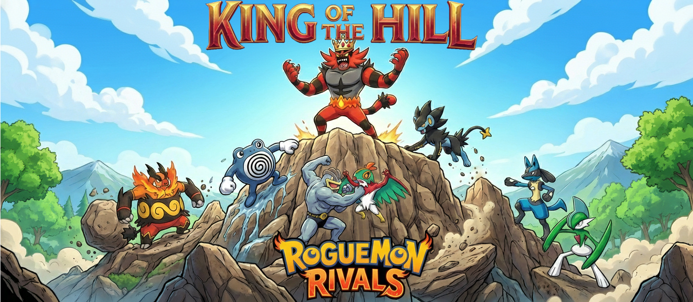
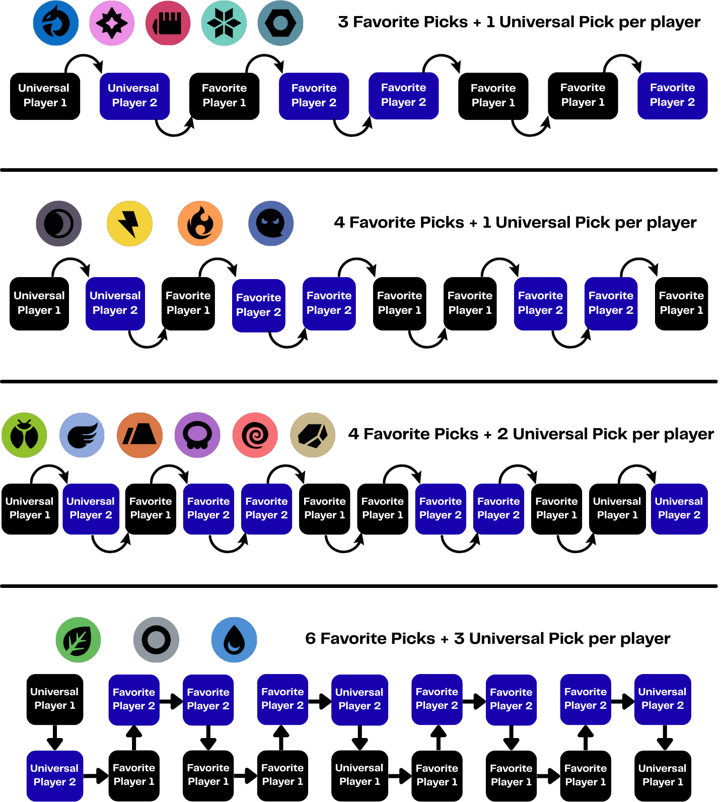
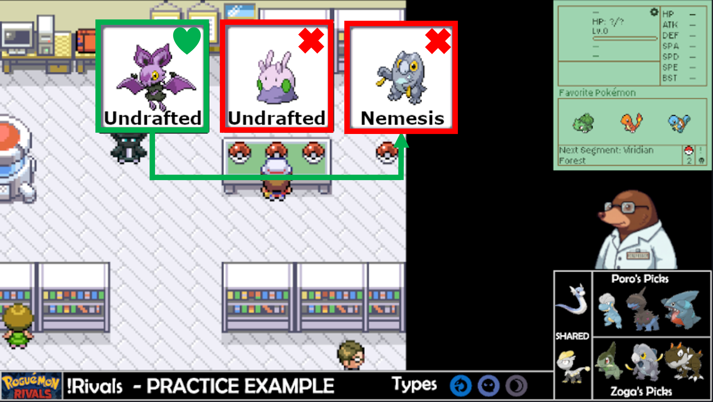
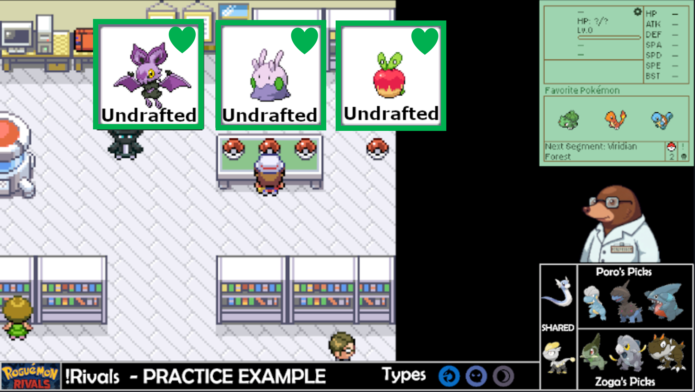
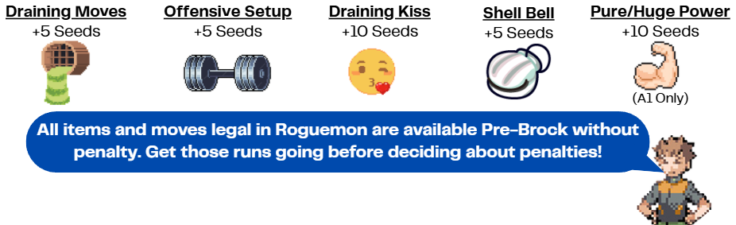

# King-of-the-Hill

### [ROUND OVERVIEW](#ROUND-OVERVIEW) | [DRAFTING](#DRAFTING-PHASE) | [PIVOTING](#PIVOTING-GUIDELINES) | [BOONS](#CHAMPION-BOONS) | [TIEBREAKERS](#TIEBREAKERS) | [PENALTIES](#PENALTY-MODIFIERS) | [RESOURCES](#RESOURCES) | [FAQ](#FREQUENTLY-ASKED-QUESTIONS) |

---

Welcome to Roguemon Rivals – King of the Hill. This is a variant of the competitive Roguemon Rivals that challenges players to a free for all climb to the top. Competitors will fight to maintain the furthest runs to avoid getting cut from the competition until only the Champion remains.

<h1 align="center">What is Roguemon Rivals?</h1>

Roguemon Rivals is a competitive format for the Roguemon Pokemon challenge where players draft Pokemon across 3 types and battle for the title of Pokemon champion. Building off of the fan-made Roguemon (LINK) created by Crozwords (a roguelike mod of FireRed/LeafGreen), this format incorporates a drafting phase, type-based victories, and marathon (longest run) type competitive gameplay. Roguemon Rivals can be played across multiple unique variations ([Tag Team Brawlers](https://github.com/ThePorofessor/Tag-Team-Brawlers), [Alphabet Draft](https://github.com/ThePorofessor/Alphabet-Draft), [King of the Hill](https://github.com/ThePorofessor/King-of-the-Hill)) or as a stand alone battle against a friend. Make sure to always check back on the rules pages as new "house rules" and gamemodes are created to keep the competition a unique experience!

If this is your first time playing Roguemon Rivals, more information on how to draft, how to pivot, and how to score your runs can be found on the original rules page ([OG Rules Page](https://github.com/ThePorofessor/Roguemon-Rivals/tree/main)).

<h1 align="center">How is King of the Hill Unique?</h1>

Roguemon Rivals at its core is a 1-on-1 battle (emphasis on the 1-on-1 aspect) where your success is determined entirely on your individual decision making and seed luck with respect to a single competitor. Roguemon Rivals is an excellent way to play Roguemon with friends and the community as decision making is at an all time high with the drafting phase, but it can be restrictive for groups of players that want to play together. In the past the community has created a [Tournament Series](https://github.com/ThePorofessor/Roguemon-Rivals-Tournament-Series) that expanded the player count up to 16 participants in a single elimination format. However, this expansion was characterized by a restricted player count and the significant time requirements. These pitfalls is where King of the Hill excels. 

King of the Hill is unique in that you are now playing a free for all against all competitors rather than a 1-on-1 match. Each round your goal is to survive the cut and advance to the next round. This variant is faster, more competitive, highly variable (see below) and more accessible to community events. Now you can play with multiple friends or join the open community tournaments.

---

<h1 align="center">ROUND OVERVIEW</h1>

King of the Hill is a competitive format that takes place over three weeks and contains no player limit. Each week players will run 50 seeds of a single predetermined type using their drafted favorite pokemon and universal picks (see Drafting Phase below). At the end of each week, players will be scored based on their furthest run (known as a personal best or PB) and the lower 50% of players will be eliminated from the competition. The top 50% of players will continue onto the next round where a new type and drafting phase will be introduced.

At the start of each round, the player scores are reset to ensure an even and competitive battle for the top spots. Eventhough the scores are reset, there is significant incentives to reaching the top spot (furthest run) through the Champion Boon system (see below).

---

<h1 align="center">DRAFTING PHASE</h1>

At the start of each round all participants will vote on universal picks that all players may use. Afterwards, players will draft favorites through our Autodrafter which has been finetuned to the Councils ranking system. Please note that the autodrafter will be used for you to select your legal Pokemon and the Nemeses (illegal Pokemon). Due to the high variety of available pivots per type, the number of favorites and universal picks has been scaled to ensure a high probability of seeing your draft each run. The overall process should take less than 5 minutes as it is entirely automated. All participants will have first pick in the draft against the Council. Please note that the pick order against the Council is in a snake style format as shown below:

### 
Drafting Phase Reference

<h1 align="center">PIVOTING GUIDELINES</h1>

Pivoting is dictated by what you drafted. Unlike the classic ruleset for Roguemon Rivals, King of the Hill does not require the abandoned balls. **Repeat everyone can scout for their favorites!** Since scouting is allowed, you can ONLY run your favorite pokemon. Nemesis and Undrafted Pokemon are banned outside of the lab. With that in mind, the lab rules are:

### Lab Priorities:
1.	You must select a drafted pokemon (Universal or Your Favorite)

<strong>Example</strong>

  

In this example, there is a favorite (Pokemon you drafted or universal pick), a nemesis (Pokemon your opponent drafted), and an undrafted pick.

2.	If you don’t have a favorite, you must fight your opponent’s favorite

<strong>Example</strong>

  

3.	If there are no favorites for either player, you have free choice.

<strong>Example</strong>

  

---

<h1 align="center">CHAMPION BOONS</h1>

At the end of each round, the top scoring players will get the opportunity to add drafting rules (known as boons) to the next round. First place will have options that can drastically change most drafting phase while second and third place will have the chance to ban specific Pokemon. If a player has a specific rule that is not listed below, please contact the competition organizers to see if it would be feasible.

| Boon | Description | Availability |
|:---:|---|---|
| **Double Trouble** | All favorite picks must contain dual typing |  |
| **Monoculture** | All dual tpying Pokemon are banned from drafting |  |
| **Weekly Allowance** | Each player's draft may not exceed a BST Limit |  |
| **False Start** | All base game starters are banned from drafting |  |
| **Babysitting** | At least one of your favorites must be a sub-300 BST Pokemon |  |
| **Draft with Phonics** | Drafts must be picked in alphabetical order |  |
| **Influencer** | All players must draft a favorite of your choice |  |
| **Feel the Rainbow** | Every Player's draft must have at least 3 unique types |  |
| **Old Dog** | At least one of your favorites must learn 3 or less moves before evo |  |
| **Lone Wolves** | Pokemon that utilize friendship evolutions are banned from drafting |  |

---

<h1 align="center">TIEBREAKERS</h1>

In the case of multiple players ending on the same segment, there are a few tiebreakers to determine the winner:
1) The player that defeated the most trainers in the final segment wins the tiebreaker.
2) If both players defeated the same number of trainers, then the player who defeated the most pokemon in the final segment wins the tiebreaker.
3) If both players defeated the same number of trainers and pokemon, then the player who reached the personal best in the lower number of seeds (factoring in the penalty modifiers) win the tiebreaker.

**Please note that the final tiebreaker is especially pertinent for tiebreakers that beat Champion.**

<h1 align="center">PENALTY MODIFIERS</h1>

An additional tiebreaker condition can be applied to Rivals. Please note that these only apply to cases invovling the second tiebreaker.

A penalty modifier increases your overall seed count if a specific condition is activated during your longest PB. Please note that this only applies to the third tiebreaker (Players defeating the same number of trainers and pokemon). The modifers are as follows:

<strong> Roguemon Classic Penalties </strong>

  

<strong> Roguemon Split Penalties </strong>

  

---

<h1 align="center">RESOURCES</h1>

[Draft Tracker](https://docs.google.com/spreadsheets/d/1w-vIBTVtaFTtdZ5n6jUGxO-SaW-L_5P-QvtL8cfddMo/edit?gid=1594516166#gid=1594516166)

[Pivot Data and Rankings](https://docs.google.com/spreadsheets/d/1tiS6qI93a8kvGv_6gLdTAVDttsU-ztQQgtx_xshBj_c/edit)

[Pokemon Sprites (Sugimori and Global Artwork)](https://drive.google.com/drive/folders/1QnI2yFlTVyjq3geyzwmnrr3_cxNlNjzI?usp=sharing)

---

<h1 align="center">FREQUENTLY ASKED QUESTIONS</h1>

<strong> How should we approach a run that ends at Cycling Road? </strong>

Cycling Road can be …. troublesome. We understand that you can technically skip Cycling Road due to the lack of mandatory trainers. To ensure a positive competitive environment, we ask that you at least attempt Cycling Road if your opponent has a PB during this segment. If you need to end early that is fine, but a complete skip is frowned upon.
 

<strong> What happens if all lab mons are unselectable? </strong>

Unfortunately, that is a seed reset.
 

<strong> What happens if I my lab pokemon has Pure/Huge Power and I only have physical moves? </strong>

Thats a seed reset, but you will be refunded the seed. Please note this doesn't apply to type resistances.
 

<strong> If I get a non-favorite shiny, can I run that instead of a favorite? </strong>

Sure! The original ruleset of Roguemon does have a Shiny clause which we will permit. IIRC the original ruleset for Roguemon allows you to level it to 8 so the shiny has a chance.
 

<strong> How do the penalties for Shell Bell, draining moves, and offensive setup factor into my score? </strong>

These penalties are only factored into winning runs (which is a low chance in A2) and will be utilized for tie breakers if both players win a seed.
 

<strong> Do I need to stream every seed attempt? </strong>

Yes! In order to verify each run and guarantee a fair competitive environment the runs must be watchable. Please make sure that your VODs are available through your preferred streaming service.
 

<strong> Is Discord a permissible alternative to streaming? </strong>

Unfortunately, it is not since the VODs would not be viewable after you ended the run.
 

<strong> Is time machining allowed for simple mistakes? </strong>

To avoid an exhaustive list of yes and no’s, all use of time machine will be banned.
 

---

<h1 align="center">CREDITS</h1>

Created by: [ThePorofessor](https://www.twitch.tv/theporofessor) and [ZogaOak](https://www.twitch.tv/zogaoak)

Draft Tracker Created by: [iAmSlammer](https://www.twitch.tv/iAmSlammer)

Inspired by: [Roguemon by Crozwords](https://github.com/Crozwords/Roguemon)

<i>Roguemon Rivals is a fan-made competition format and not affiliated with Nintendo, Game Freak, or The Pokémon Company.</i>

